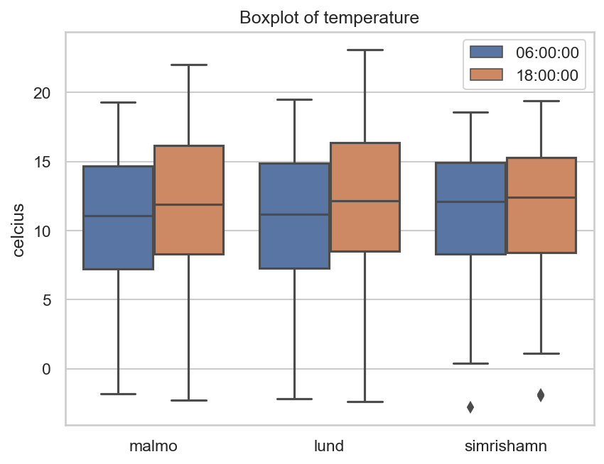
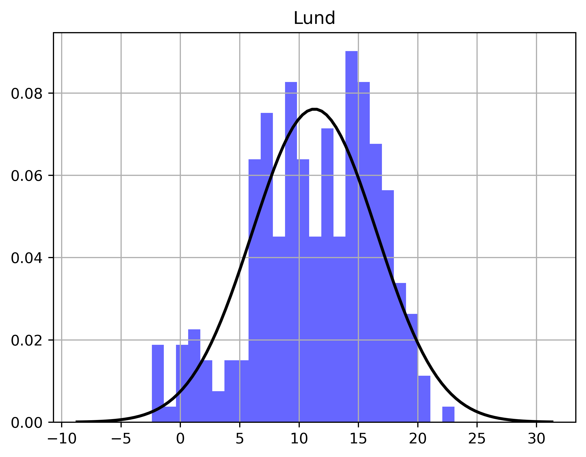
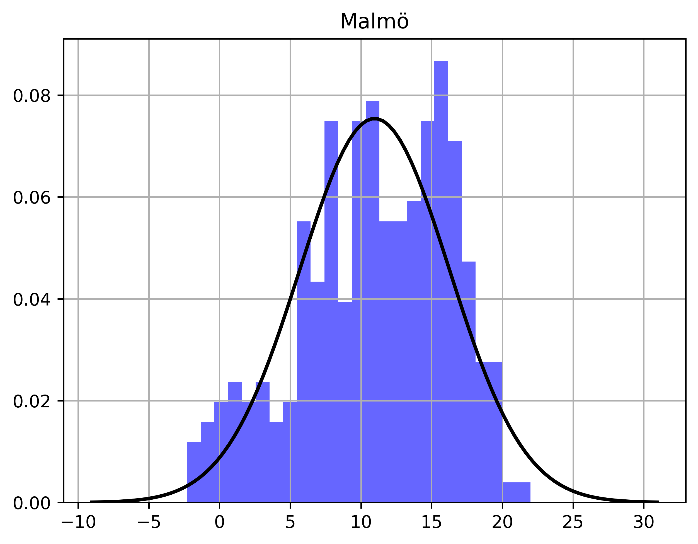
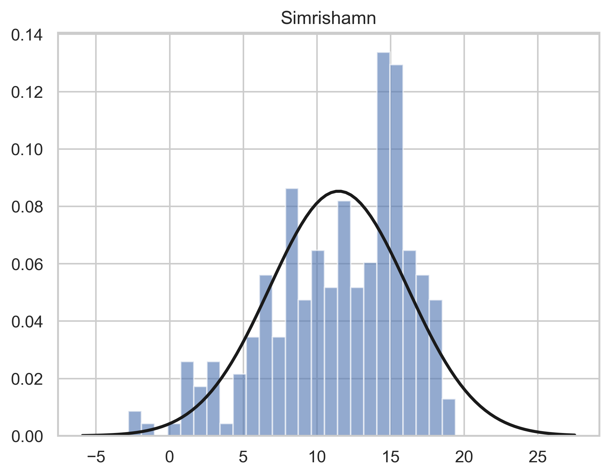
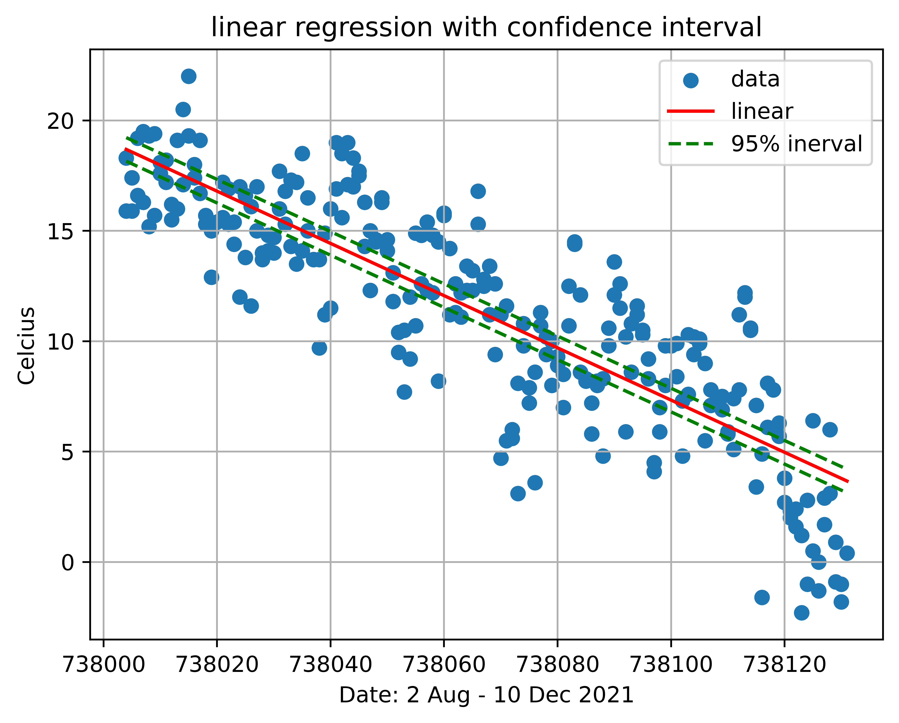
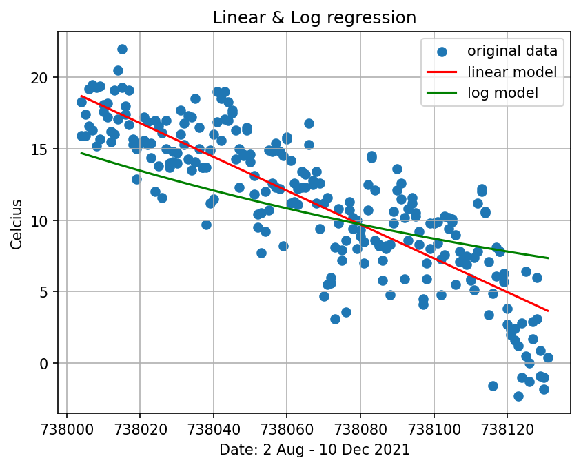
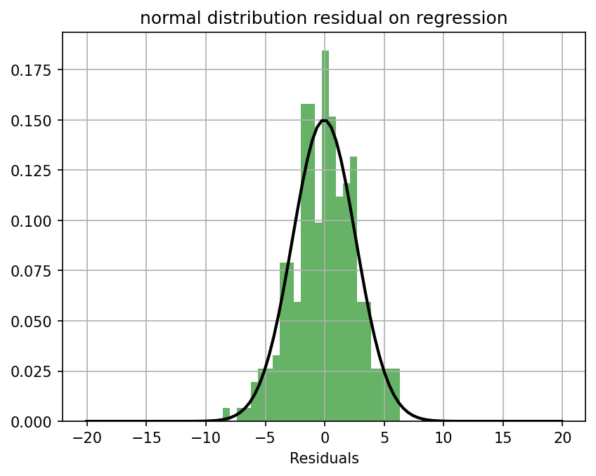
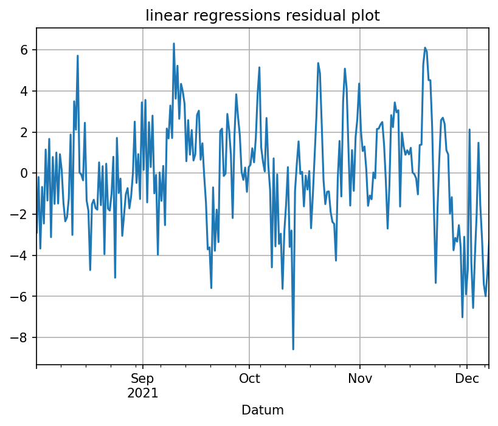
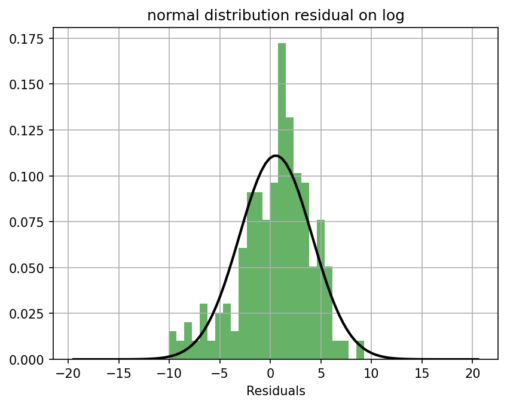
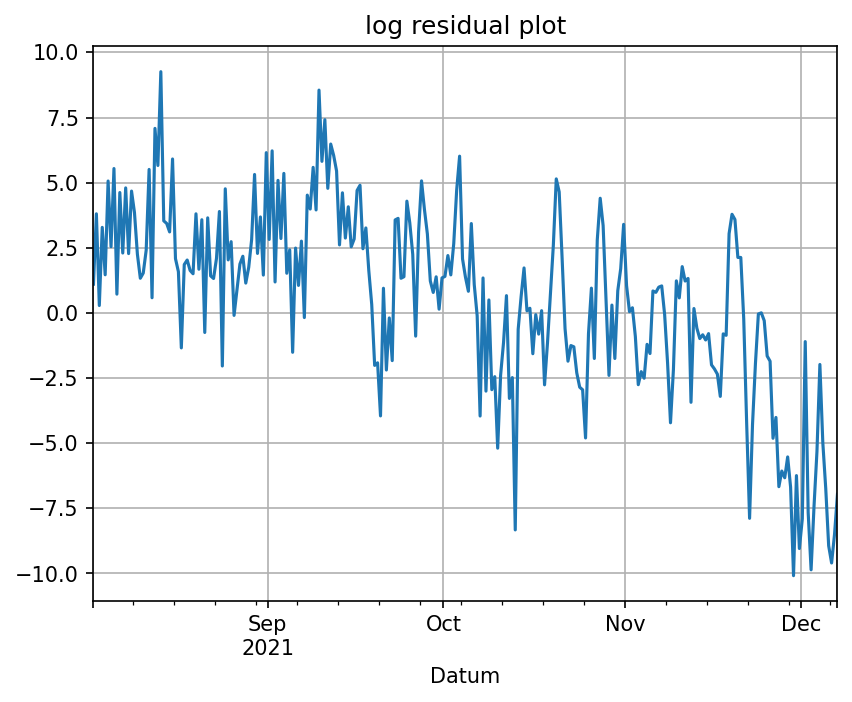

# Rikards Larsson (Rilr20) Matmod Project 
<!-- 
Statistiska analyser kan användas för att komma fram till rimliga slutsatser eller fatta beslut. En
utmaning när man genomför statistiska analyser är att presentera dem på ett lättförstått och
överskådligt sätt.

Inlämningen av projektet ska bestå av en skriftlig rapport där uppgift 1-7 besvaras med text och
plottar, samt inlämning av all kod och data som använts i er analys. Uppgifterna löses i valfritt
programmeringsspråk. 

-->

## Uppgift 1:Beskriv data
<!--

Introducera den data som valts och beskriv vad den visar och varifrån den kommer. Cirka 250 ord
(halv A 4 ). Var tydliga med vad de olika variablerna beskriver och i vilken enhet de är i. Det kan vara
en god idé att ha en mindre tabell med ett urval från datan för att lättare beskriva mätvärdena.

Det ska också finnas en visuell representation av hur datamängden ser ut, samt tillhörande figurtext
med förklaringar till vad som visas och om det finns några konstigheter (till exempel outliers i datan).
Visualiseringen görs med lämplig plot, t.ex. stapeldiagram, linjediagram, scatterplot, cirkeldiagram
etc. **Obs! Glöm inte att ange enheter på axlarna!** 

-->

    

Datan kommer ifrån SMHIs väderstationer. Väderstationerna som jag har valt är aktiva väderstationer. De stationerna som jag valde heter Malmö A, Lund, Skillinge A. Simrishamns väderstation var inte aktiv så då valdes Skillinge A istället för den var närmst och aktiv.

Väderstationen Malmö A stationen ligger inom storstadsregionen och Lunds mätstation ligger inom deras stadsgränser. Skillinge A är en mätstation som ligger vid kusten. Dessa tre stationer valdes för de är inom samma region och för att se om det finns någon differens på mätdatan.

De tre väderstationerna samlar datan olika ofta för att det ska bli en rättvis jämförelse så kommer min temperaturavläsning att ske vid 6:00 och 18:00. De resterande klockslagen ignoreras ifall det förekommer mättemperaturer. 

Variablerna som används är lufttemperatur, datum, och tid.
Temperaturen som mäts är i celcius. Mättillfällena  är från 2 augusti till 10 december 2021. Då får man temperaturen för höst- och vinterväder i 130 dagar.

Vid vissa tidpunkter så finns det felkoder där temperaturerna avläses men jag vet inte om avläsningen har skett korrekt eftersom på en avläsning står det "stationen eller givaren har varit ur funktion.". Men ett värde har ändå skrivits in, av datan som används så har det bara hänt i Lund.

<!-- SMHI skickar med en kvalitetskod vid varje mätpunkt och den är "G" på alla. Då har inga problem uppstått under mätningarna.  -->

Exempel på datan som finns och används i programmet. 
<table style="margin:auto;">
        <tr>
            <th>Mätstation</th>
            <th>Temperatur (Celcius)</th>
            <th>Tid</th>
            <th>Datum</th>
        </tr>
        <tr>
            <td>Malmö</td>
            <td>11.6</td>
            <td>6:00</td>
            <td>2021-08-24</td>
        </tr>
        <tr>
            <td>Malmö</td>
            <td>16.1</td>
            <td>18:00</td>
            <td>2021-08-24</td>
        </tr>
        <tr>
            <td>Malmö</td>
            <td>15.0</td>
            <td>6:00</td>
            <td>2021-08-25</td>
        </tr>
        <tr>
            <td>Malmö</td>
            <td>17.0</td>
            <td>18:00</td>
            <td>2021-08-25</td>
        </tr>
        <tr>
            <td>Malmö</td>
            <td>13.7</td>
            <td>6:00</td>
            <td>2021-08-26</td>
        </tr>
        <tr>
            <td>Malmö</td>
            <td>14.0</td>
            <td>18:00</td>
            <td>2021-08-26</td>
        </tr>
        </table>

<!-- Analys -->

I figur 1 så ser man temperaturskillnaden i Simrishamn är markant mindre jämfört med Malmö och Lunds. Simrishamn har även tre outliers och det är de tre dagarna som är minusgrader. -2.8 klockan på morgonen och -1.9, -2.0 på kvällen. De lägsta och högsta temperaturvärderna är under 18:00 klockslaget för Lund och Malmö. Datan för Simrishamn så är den lägsta temperaturen på morgon och den högsta på kvällen. De högsta och lägsta temperaturerna förekommer i Lund.
    

    

        
        
Fig 1: Lådagram över temperaturen under en 6 månaders period uppdelad i morgon- och kvällstemperatur

    

## Uppgift 2: Beskrivande statistik
<!-- Gör en tabell innehållande beskrivande statistik av din data. Denna ska innehålla medelvärde,
standardavvikelse, max- och min-värde samt korrelationen mellan variablerna. Korrelationen kan
också med fördel visualiseras i form av en heatmap (i python Seaborn.heatmap(korrelation)).

Till dessa tabeller ska också en kortare text om vad dessa värden säger om er data och om det går att dra några slutsatser utifrån den. -->

<!--   -->

<!--  -->

    

        <!-- 
        
Fig 2: Tabell för varje stad med medelvärdet, standrardavvikelsen max värde och min värdet.

         
         
         
         
         
         
          -->
        
        
Fig 3: Korrelation mellan de tre väderstationerna

         
         
        <table style="padding:0;">
            <tr>
                <th>Stad</th>
                <th>Medelvärde</th>
                <th>Standardavvikelse</th>
                <th>Max-värde</th>
                <th>Min-värde</th>
            </tr>
                <tr>
                    <td>Malmö</td>
                    <td>10.970881</td>
                    <td>5.290972</td>
                    <td>22.0C</td>
                    <td>-2.3C</td>
                </tr>
                <tr>
                    <td>Simrishamn</td>
                    <td>11.483525</td>
                    <td>4.67948</td>
                    <td>19.4C</td>
                    <td>-2.8C</td>
                </tr>
                <tr>
                    <td>Lund</td>
                    <td>11.306897</td>
                    <td>5.24404</td>
                    <td>23.1C</td>
                    <td>-2.4C</td>
                </tr>
        </table>
    

<!-- Tabellvärden på korrelationen
    <table>
    <tr>
        <th>Korrelation</th>
        <th>Lund</th>
        <th>Malmö</th>
        <th>Simrishamn</th>
    </tr>
    <tr>
        <td>Lund</td>
        <td>1</td>
        <td>0.9870</td>
        <td>0.9403</td>
    </tr>
    <tr>
        <td>Malmö</td>
        <td>0.9870</td>
        <td>1</td>
        <td>0.9325</td>
    </tr>
    <tr>
        <td>Simrishamn</td>
        <td>0.9403</td>
        <td>0.9325</td>
        <td>1</td>
    </tr>
</table> -->
Korrelationen mellan de tre väderstationerna är hög vilket kan bero på att de ligger nära till varandra. Malmö och Lunds är lika medans Simrishamn sticker ut men inte med mycket.

Simrishamn har högst medelvärde fast de har lägsta max- och min-värde. Min-värdet där var dock en outlier så resterande data kan ligga närmre varandra. Värdet på medeltemperaturen skiljer inte så mycket mellan varandra.

## Uppgift 3: Beskrivande plottar
<!-- Gör minst en graf till för att visuellt analysera er data. Det kan till exempel vara ett histogram som
jämförs mot normalfördelningen eller ett lådagram för att vissa hur spridningen av data ser ut. -->

    

        
        
Fig 4: Histogram och normalfördelning av temperaturerna för mätstationen Lund

    

    

        
        
Fig 5: Histogram och normalfördelning av temperaturerna för mätstationen Malmö

    

    

        
        
Fig 6: Histogram och normalfördelning av temperaturerna för mätstationen Simrishamn

    

Histogrammen ser ut att följa normalfördelningen men det skulle behövas mer data för att säkert säga att det följer. Alla tre histogrammen så är det glest med temperaturavläsningar i den övre kvantilerna. Detta kan beror på att det är senhöst väder som sedan blir vintervärde.

Simrishamn har väldigt många mätpunkter på 14 och 15 grader så att det inte förhåller sig med normalfördelningen. Detta kan vara varför medelvärdet är högre än de andra två mätstationerna.

## Uppgift 4: Linjär regression
<!-- 
Utför en linjärregression av minst en av variablerna och ett tillhörande 95% konfidensintervall.
Rapportera variablerna 𝑎 och 𝑏 i sambandet 𝑦=𝑎+𝑏∙𝑥 samt punktskattningens
konfidensintervall av dessa. Visualisera detta i en graf med den linjära modellen, konfidensintervallet
och originaldata i samma figur. -->

<!-- A = [18.71231311] B = [-0.05908414] -->
<!-- interval = 0.534335742123695 -->

    

        

        Variablerna i den linjära regressionen så är riktningskoefficienten b lika med -0.05908414 och konstanten a är lika med 18.71231311. För få ut det tvåsidiga 95 procentiga konfidensintervallet så använder man värdet 0.534335742123695. Den linjära regressionen har en negativ lutning. Denna negativa lutningen passar då det blir kallare när det går från höst till vinterväder.
        

    

    

        
        
Fig 7: Linjär regression av alla tre väderstationerna

    

## Uppgift 5: Transformerad data
<!-- Ibland passar inte den data man har till en linjär modell. Då kan det ibland gå att lösa genom att
transformera data med exempelvis med en logaritmisk funktion. Prova minst en transformation av
din data och skapa en ny regressionsanalys. Plotta sedan den nya modellen tillsammans med
originaldata och jämför med den tidigare modellen. **Obs! Glöm inte att transformera tillbaka
modellen och er data innan ni plottar dessa. Annars kan ni inte göra en tydlig jämförelse mellan de
två modellerna.** -->

    

        

            Väderdatan transformerades till en logaritmisk funktion. Den logaritmiska linjen startar under de flesta mätpunkterna för temperaturen och slutar över de flesta datapunkterna i slutet av datan. Tillskillnad från den linjära regressionen som försöker vara i mitten av alla datapunkterna.
        

        

            Den linjära regressionen ser ut att följa datan bättre än vad den logaritmiska funktionen gör, då datapunkterna är närmre den regressionen. Den linjära regressionen är lättare att avläsa hur temperaturen ändras sig under perioden.
        

    

    

        
        
Fig 8: Linjär regression och logaritmisk regression

    

## Uppgift 6: Residualanalys
<!-- 
Beräkna residualerna, 𝑒= 𝑦−𝑦̂, för de två modellerna och plotta dessa. Hur ser de ut? Plotta
residualerna mot normalfördelningen (i Python t.ex. genom Seaborn.distplot eller
scipy.stats.probplot). Kommentera dessa plottar utseende och beskriv vilka slutsatser vi kan dra
utifrån dessa. Finns det några beroenden? Hur väl följer residualerna en normalfördelning? -->

    

        
I figur 10 ser man att residualerna för den linjära regressionen ligger relativt nära regressionen i början av datan men i slutet så är residualerna väldigt höga eller väldigt låga. När residualerna är i en normalfördelningen (fig. 9) så kan man se att standardavvikelsen inte är så hög då normalfördelningen är lång och smal. Vilket kan tyda på att den linjära regressionen passar bra då de flesta residualerna är runt 0 vilket är vad medelvärdet ligger nära.

        
Den logaritmiska regressionens residualer (fig. 12) ser ut att följa samma mönster som med den linjära (fig. 10). Det passar bättre i början men sedan i slutet av datan så passar det inte lika bra. I normalfördelningen så är standardavvikelsen större än i figur 9. Medelvärdet är större än i den linjära regressionens normalfördelning. Detta visar att den logaritmiska regressionen passar inte lika bra som med den linjära.

        

        Det låga temperaturerna är vad som har påverkat residualerna i slutet av figur 10 och figur 12.
        

    

    

        

            

                
                
Fig 9: Linjära regressionens residualer i ett histogram och en normalfördelning med medelvärde på -0.05334

            

            

                
                
Fig 10: plot över residualerna för linjär regression 

            

        

            

                

                    
                    
Fig 11: Logaritmisk regressionens residualer i ett histogram och en normalfördelning med medelvärde på 0.53280

                

                

                    
                    
Fig 12: plot över residualerna för logaritmisk regression

                

            

        <!-- 
        
Fig 10: Linjär regression av alla tre väderstationerna

    

## Uppgift 7: Sammanfattning
<!-- Skriv en sammanfattning av din analys och vilka slutsatser du kommit fram till, max halv A4. -->

Sammanfattningsvis så är den linjära regressionen den bättre regressionen för denna typ av data. Då många av residualerna ligger runt noll då medelvärdet ligger på -0.05. Datan som används är från höst till vinter påverkan detta har på datan är att regressionerna har en negativ lutning. På grund av att vädret på datan går från sensommar/höst till vinter så får man fler kallare värden än om man hade gjort denna analysen tidigare. Värderna påverkar hur histogrammen ser ut hade mätperioden varit över ett helt år så hade värderna troligtvis följt normalfördelningen bättre. Histogrammets jämförelse mot normalfördelning så ser man fler kallare värden som på den nedre kvantilerna. Under denna mätperioden har det har då blivit en överreprensentation av kallare värden.

Stationerna ligger i olika typer av miljöer detta kan påverka datan då man inte vet om stadsmiljöerna påverkar temperaturen. Det finns ingen stor differens på datan då korrelationen mellan de tre mätstationerna är relativt hög. Om mätstationerna var mer utspridda så hade korrelationen sett annorlunda ut.

<!-- En annan effekt kan vara att histogrammen har fler värden som är kallare än genomsnittet på ett år. Normalfördelningen är då inte helt exakt då det är bara väder och temperatur för mindre än ett halvår. -->
 
 <!-- På grund av att datan är från höst till vinter så det vara mer kallare data på väderstationernas histogram. Det gör även så att regressionerna blir negativa då vädret blir kyligare.  -->