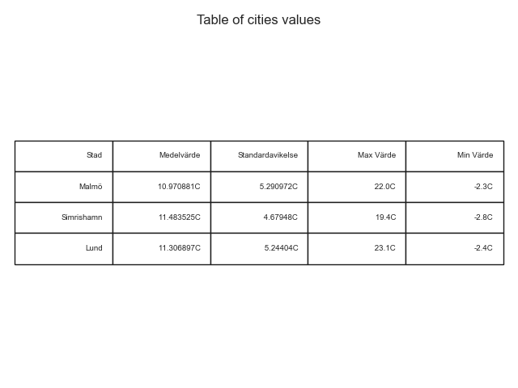
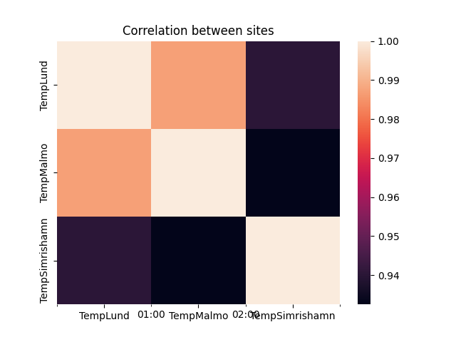

# Rikards Rilr20 Project 

## Uppgift 1:Beskriv data
<!-- Introducera den data som valts och beskriv vad den visar och varifrån den kommer. Cirka 250 ord
(halv A 4 ). Var tydliga med vad de olika variablerna beskriver och i vilken enhet de är i. Det kan vara
en god idé att ha en mindre tabell med ett urval från datan för att lättare beskriva mätvärdena.

Det ska också finnas en visuell representation av hur datamängden ser ut, samt tillhörande figurtext
med förklaringar till vad som visas och om det finns några konstigheter (till exempel outliers i datan).
Visualiseringen görs med lämplig plot, t.ex. stapeldiagram, linjediagram, scatterplot, cirkeldiagram
etc. **Obs! Glöm inte att ange enheter på axlarna!** -->
Jag har valt temperaturdata från SMHI. Datan är från 30 Augusti till 7 December 2021. Väderstationerna som valts är Karlskrona, Lund och Simrishamn. Tiderna för temperaturerna som kollas är klockan 6:00 och 18:00 på varje dag. 

Exempel på data som används
<table>
<tr>
    <th>Stad</th>
    <th>Temperatur</th>
    <th>Tid</th>
    <th>Datum</th>
</tr>
<tr>
    <td>Malmö</td>
    <td>11.6</td>
    <td>6:00</td>
    <td>2021-08-24</td>
</tr>
<tr>
    <td>Malmö</td>
    <td>16.1</td>
    <td>18:00</td>
    <td>2021-08-24</td>
</tr>
<tr>
    <td>Malmö</td>
    <td>15.0</td>
    <td>6:00</td>
    <td>2021-08-25</td>
</tr>
<tr>
    <td>Malmö</td>
    <td>17.0</td>
    <td>18:00</td>
    <td>2021-08-25</td>
</tr>
<tr>
    <td>Malmö</td>
    <td>13.7</td>
    <td>6:00</td>
    <td>2021-08-26</td>
</tr>
<tr>
    <td>Malmö</td>
    <td>14.0</td>
    <td>18:00</td>
    <td>2021-08-26</td>
</tr>
</table>
Variablerna som används är Lufttemperatur, datum, tid. Lufttemperaturen är i celcius.

## Uppgift 2: Beskrivande statistik
<!-- Gör en tabell innehållande beskrivande statistik av din data. Denna ska innehålla medelvärde,
standardavvikelse, max- och min-värde samt korrelationen mellan variablerna. Korrelationen kan
också med fördel visualiseras i form av en heatmap (i python Seaborn.heatmap(korrelation)).

Till dessa tabeller ska också en kortare text om vad dessa värden säger om er data och om det går att
dra några slutsatser utifrån den. -->

Tabell för varje stad med medelvärdet, standrardavvikelsen max värde och min värdet.
 

Bild på correlationen

### Korrelations tabell

<table>
<tr>
    <th>Korrelation</th>
    <th>Lund</th>
    <th>Malmö</th>
    <th>Simrishamn</th>
</tr>
<tr>
    <td>Lund</td>
    <td>1</td>
    <td>0.9870</td>
    <td>0.9403</td>
</tr>
<tr>
    <td>Malmö</td>
    <td>0.9870</td>
    <td>1</td>
    <td>0.9325</td>
</tr>
<tr>
    <td>Simrishamn</td>
    <td>0.9403</td>
    <td>0.9325</td>
    <td>1</td>
</tr>
</table>

## Uppgift 3: Beskrivande plottar
<!-- Gör minst en graf till för att visuellt analysera er data. Det kan till exempel vara ett histogram som
jämförs mot normalfördelningen eller ett lådagram för att vissa hur spridningen av data ser ut. -->
## Uppgift 4: Linjär regression
<!-- 
Utför en linjärregression av minst en av variablerna och ett tillhörande 95% konfidensintervall.
Rapportera variablerna 𝑎 och 𝑏 i sambandet 𝑦=𝑎+𝑏∙𝑥 samt punktskattningens
konfidensintervall av dessa. Visualisera detta i en graf med den linjära modellen, konfidensintervallet
och originaldata i samma figur. -->
## Uppgift 5: Transformerad data
<!-- Ibland passar inte den data man har till en linjär modell. Då kan det ibland gå att lösa genom att
transformera data med exempelvis med en logaritmisk funktion. Prova minst en transformation av
din data och skapa en ny regressionsanalys. Plotta sedan den nya modellen tillsammans med
originaldata och jämför med den tidigare modellen. **Obs! Glöm inte att transformera tillbaka
modellen och er data innan ni plottar dessa. Annars kan ni inte göra en tydlig jämförelse mellan de
två modellerna.** -->
## Uppgift 6: Residualanalys
<!-- 
Beräkna residualerna, 𝑒= 𝑦−𝑦̂, för de två modellerna och plotta dessa. Hur ser de ut? Plotta
residualerna mot normalfördelningen (i Python t.ex. genom Seaborn.distplot eller
scipy.stats.probplot). Kommentera dessa plottar utseende och beskriv vilka slutsatser vi kan dra
utifrån dessa. Finns det några beroenden? Hur väl följer residualerna en normalfördelning? -->
## Uppgift 7: Sammanfattning
<!-- 
Skriv en sammanfattning av din analys och vilka slutsatser du kommit fram till, max halv A4. -->
